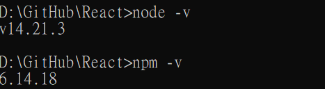

# 準備開發工具及環境

### npm
是 node.js 的預設套件管理工具
像是 python 中的 pip

### node.js
要開發 React，而 React.js 是一個 JavaScript 函式庫，需要透過 node.js 運行

### nvm
用於 管理/切換 多版本 node.js 的工具

### 使用 create-react-app 創建一個專案
creat-react-app 是 Facebook 設計的建立 React.js 開發環境的套件

只需要一行指令就可以快速建立一個 React

他提供了一個標準的檔案結構和一系列有用的工具