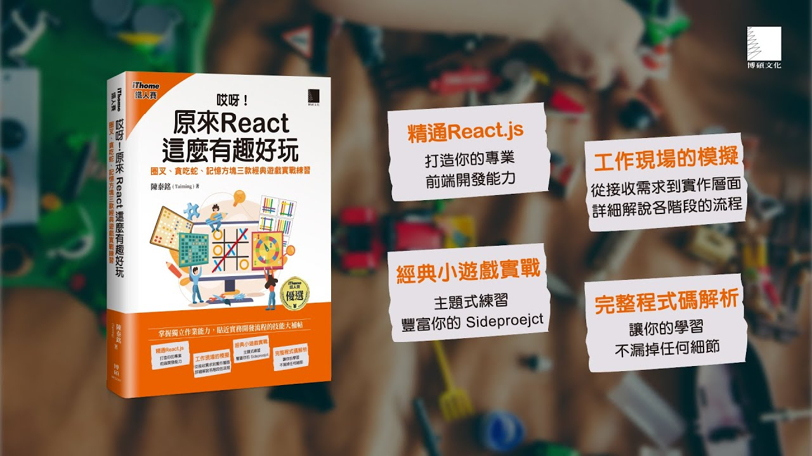
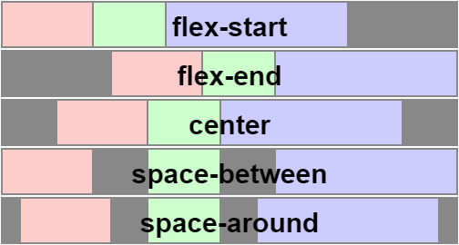

# 1.1 準備開發工具及環境

### npm
是 node.js 的預設套件管理工具
像是 python 中的 pip

是在 npm v5.2.0 之後內建的指令，可以自動安裝 package 並執行內部的指令

不需要手動安裝或指定完整路徑
使用方式很簡單，只需要輸入
```JS
npx package name
```

### node.js
要開發 React，而 React.js 是一個 JavaScript 函式庫，需要透過 node.js 運行

### nvm
用於 管理/切換 多版本 node.js 的工具


# 1.2 使用 create-react-app 創建一個專案
create-react-app 是 Facebook 設計的建立 React.js 開發環境的套件

只需要一行指令就可以快速建立一個 React

他提供了一個標準的檔案結構和一系列有用的工具

簡單來說不需要自己設置安裝，就可以使用最新的 ES6 語法等等

create-react-app 支持 "自動化建構"、"模組管理"、"代碼分割" 等等功能
還提供 "開發伺服器"，可以在本地端測試應用程式

只需要輸入
```JS
> npx create-react-app 應用程式名稱
```

在使用 create-react-app 之前，要先確認自己的 
* Node >= 14.00
* npm  >= 5.6




萬事俱備之後，就可以使用以下指令建立專案了！
讓我們建立一個圈圈叉叉的專案
```JS
npx create-react-app tic-tac-toe
```
* 實作我放在 Repository [React_implement](https://github.com/chullin/React_implement)


沒想到要跑蠻久的，大概 5 分鐘?

太好玩了吧?! 跟著書一起做真的覺得很容易呢！
看著官網做我頭好痛

接著，開啟專案資料夾，並執行
```JS
cd tic-tac-toe
npm start
```

就會自己跳出瀏覽器


啟用成功！

創建好後，資料夾檔案內容如下


index.html 是裡面唯一一個 html 檔
另一個重要的檔案在 src 裡面的 index.js

在這個 index.js 中使用 ReactDOM 物件中的 createRoot() 將 React 元素顯示到 index.html 中相對應的 id (id=root) 中


而下面

```JS
<React.StrictMode>
    <App />
</React.StrictMode>
```
是用於引入 App.js 這個檔案的程式碼


這一頁裡面所描述的 JSX (JSX 在語法上看起來與HTML 相近，但它其實是JavaScript 的語法擴展)
所描述的就是我們啟動本機伺服器後，在網址輸入 localhost:3000 看到的內容。所以接下來我們圈圈叉叉遊戲就是要改掉這一頁的內容

因此，在這個檔案當中引入 app.css 以及 logo.svg 都跟我們遊戲專案無關，到時候再改寫這一頁的時候，可以放心的把他們都砍了


<hr>

### ESLint
ESLint 是一個檢查程式碼品質的工具，他可以用於檢查程式碼是否符合指定的規範，並指出不符合規範的地方

它支持多種程式語言，包括 JavaScript、TypeScript、Java 和 Python 等

你可以在程式碼中指定規範，然後通過命令列工具執行 ESLint，舉裡來說

* 找出語法錯誤
    * 是否使用了沒有宣告的變數、是否少了括號等等常見的語法錯誤
* 確保遵循最佳實踐
    * 不使用全域變數、建議使用 === 而非 ==、不使用 eval 等等
* 