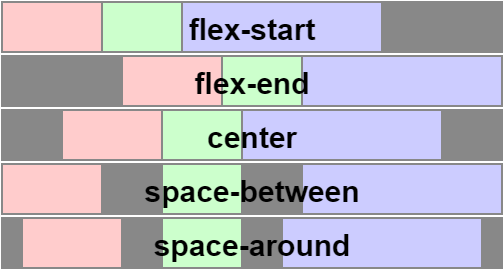
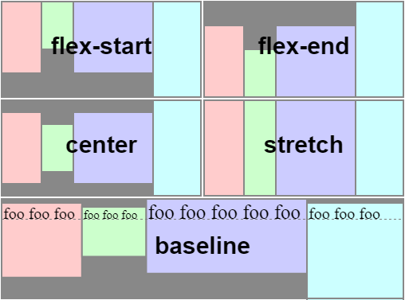
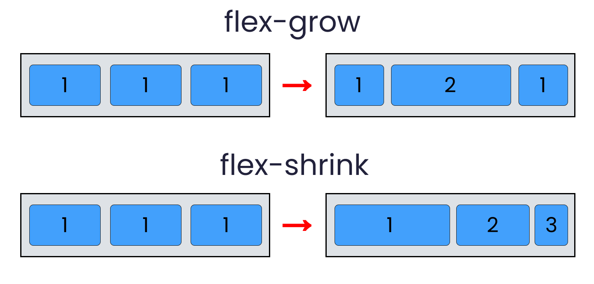
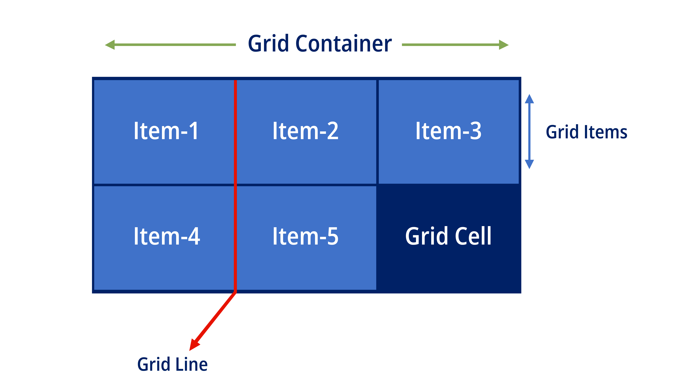
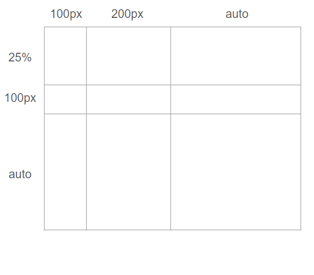
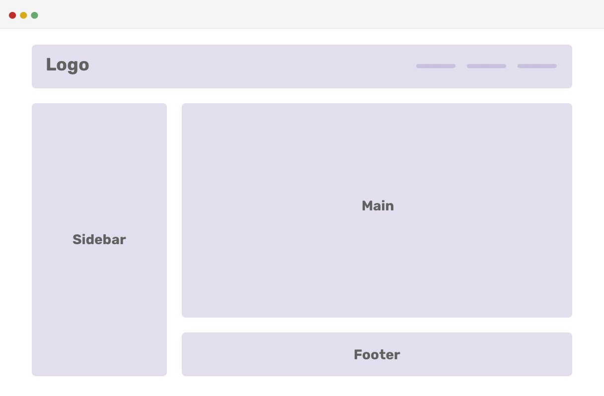

# CSS 排版工具
* CSS Flex
* CSS Grid
* React Hook

這些技巧可以幫我們更掌握 React 的狀態控制 與 生命週期，還有跟時間控制相關的 setTimeout、setInterval(設定間隔)

# CSS Flex
Flex 是 Flexible Box 的縮寫

外容器(Container)、內元件(Items)


如果把外容器的屬性用在內元件上

內元件的屬性用在外容器上

語法雖然沒錯，但會因為屬性放錯地方而沒有效用

當專案複雜時，它有可能會是別人的外元件，同時又是別人的外容器！

```HTML
<div className="flex-container">
    <div className="Item"></div>
    <div className="Item"></div>
    <div className="Item"></div>
</div>
```

為了使用 Flex，我們要先在外容器宣告

```CSS
.container{
    display: flex;
}
```


## 元件排列方式

在 Flex 中，我們可以決定元件是 
* 水平排列    (row, 左到右)
* 反轉水平排列(row-reverse, 右到左)
* 垂直排列    (column, 上到下)
* 反轉垂直排列(column-reverse, 下到上)

```CSS
.container{
    display:flex;
    flex-direction: row | row-reverse | column | column-reverse;
}
```

#### "主軸" 與 "交錯軸" 的定義會隨著 flex-direction 設置不同而改變！

## 元件"換行"處理
處理換行就代表是由上到下，所以方向是 column，換行是捲動(wrap)滾輪
* 換行
* 不換行
* 換行反轉
```CSS
.container{
    display:flex;
    flex-direction:column;
    flex-wrap:wrap | nowrap | wrap-reverse;
}
```
## 主軸對齊 justify-content
這個屬性要在 "容器" 上宣告

以橫向(左右)為主軸：

justify-content：


#### flex-first 是預設值！

## 交錯軸對齊 align-item"s"
以縱軸(上下)為主

align-items：


#### stretch (拉緊、拉伸)，所以效果是佈滿整版，這是預設值！


## 內元件的 Flex 屬性
* flex-grow：伸縮性，預設值 0，0 不會縮放，當空間還有剩餘時，會按照比例分配給同個空間下的內元件
* flex-shrink：收縮性，預設值 1，0 不會收縮，空間不夠時，會依照比例壓縮多少比例單位
* flex-basis：元件的基準值，可使用不同的單位，ex：px

```CSS
.item{
    flex: 1 1 100px;
}

/* 也可以 */

.item{
    flex-grow: 1;
    flex-shrink: 1;
    flex-basis: 100px;
}
```



# CSS Grid
是專門處理二維網格系統的排版工具



```HTML
<div className="grid-container">
    <div className="items">item-1</div>
    <div className="items">item-2</div>
    <div className="items">item-3</div>
    <div className="items">item-4</div>
    <div className="items">item-5</div>
    <div className="items">item-6</div>
    <div className="items">item-7</div>
    <div className="items">item-8</div>
    <div className="items">item-9</div>
</div>
```

```CSS
.grid-container{
    display:grid;
}
```

### 外容器中定義版型的結構
在 Grid 使用中，一個大重點是要定義外容器的版型

換句話說，我們要定義出直排(columns)、橫列(rows)的格線

* 左右水平方向：grid-template-column"s"
* 上下垂直方向：grid-template-row"s"



```CSS
.grid-container{
    height    :500px;
    width     :500px;
    background:#CAD8F8;
    display   :grid;
    grid-template-columns:100px 200px auto;
    grid-template-rows   :25%   100px auto;
}

.item{
    border:1px solid #A1A1A1;
}
```



這個結構該如何寫 HTML、CSS

其實跟上面的程式碼幾乎一模一樣，只需要再新增一個屬性

* grid-template-areas

```CSS
.grid-container{
    height:500px;
    width:500px;

    display:grid;
    grid-template-columns:100px 200px auto;
    grid-template-rows   :25%   auto  100px;
    grid-template-areas:
        "logo    logo   logo"
        "sidebar main   main"
        "sidebar footer footer"
}
```

```HTML
<div className="grid-container">
    <div className="logo">Logo</div>
    <div className="sidebar">sidebar</div>
    <div className="main">Main</div>
    <div className="footer">Footer</div>
</div>
```
最後在為他們上色
```CSS
.header{
    background:pink;
    grid-area: logo;
}

.sidebar{
    background:yellow;
    grid-area: sidebar;
}

.Main{
    background:orange;
    grid-area: main;
}

.Footer{
    background:#EEEE;
    grid-area: footer
}
```

#### 注意！grid-template-area 中，標記的區塊必須是連續的，只能是水平或垂直，不能是 L 型、ㄈ型、跨格線等等

## React Hook、useState
Hook 是 React 16.8 中增加的新功能。它讓你不必寫 class 就能使用 state 以及其他 React 的功能。

```JS
import React, { useState } from 'react';

function Example() {
  // 宣告一個新的 state 變數，我們稱作為「count」。
  const [count, setCount] = useState(0);

  return (
    <div>
      <p>You clicked {count} times</p>
      <button onClick={() => setCount(count + 1)}>
        Click me
      </button>
    </div>
  );
}
```


上述是使用 Hook 來寫，下面則是一個相等的 class 範例

```JS
class Example extends React.Component {
  constructor(props) {
    super(props);
    this.state = {
      count: 0
    };
  }

  render() {
    return (
      <div>
        <p>You clicked {this.state.count} times</p>
        <button onClick={() => this.setState({ count: this.state.count + 1 })}>
          Click me
        </button>
      </div>
    );
  }
}
```

也可以這樣寫

```JS
class Example extends React.Component {
  constructor(props) {
    super(props);
    this.state = {
      count: 0
    };
  }

  handleClike = () => {
    this.setState({
        count: this.state.count + 1,
    });
  };

  render() {
    return (
      <div>
        <p>You clicked {this.state.count} times</p>
        <button onClick={this.handleClick}>
          Click me
        </button>
      </div>
    );
  }
}
```

## React Hook、setEffect

你從前可能在 React component 做過 fetch 資料、訂閱、或手動改變 DOM。我們稱這些操作「side effect」（或簡稱 effect）因為他們可以影響其他 component 且在 render 期間無法完成。

Effect Hook useEffect 在 function component 中加入運作 side effect 的能力。他和 componentDidMount，componentDidUpdate，與 componentWillUnmount 有著同樣的宗旨，但整合進一個單一的 API。

```JS
useEffect( () => {
    document.title = `You click $(count) times`;
}, [count]);  // 僅在計數更改時才重新執行 effect
```

範例中，我們將 [count] 作為第二個參數傳遞，如果 count 等於 5，然後 component 重新 render 了一次， count 仍然等於 5，React 發現前後都等於 5，所以 React 就會忽略這個 useEffect。

如果 render 時，將 count 更新為 6，React 發現 count 有變動，就重新執行 useEffect

### 上述兩個 React Hook 都是之後會大量用到的 Hook


## setTimeout 與 setInterval
#### setTimeout

因為書中是以遊戲為主題，因此會需要控制畫面的播放、進行，或是一些延遲效果，所以會大量用到這兩個時間控制函式

`setTimeout()` 是在延遲某段時間，單位為毫秒，之後才去執行 「一次」指定的程式碼，並且會回傳一個獨立的 timer ID

```JS
const delayTime = 1000; // 單位：毫秒
let timeoutID = setTimeout( ( () => {
    console.log("執行某某任務")
}), delayTime);
```

#### setInterval
setInterval 則是固定延遲一段時間後，執行對應的程式碼，然後「不斷循環」，也會回傳一個獨立的 timer ID

```JS
const timeInterval = 1000; // 單位：毫秒
let timeoutID = setInterval( ( () => {
    console.log("執行某某任務");
}), timeInterval);
```

### 取消 setTimeout() 和 setInterval()
以 setInterval 來說，它一但啟動，就不會停下來

因此，我們可以使用 `clearInterval()` 來取消 `setInterval()`

當我們呼叫 setTimeout()、setInterval() 他們會回傳一個獨立 timer ID，這個 ID 就是用來取消的數字

```JS
clearTimeout(timeoutID);

clearInterval(timeoutID);
```

需要注意的是 setTimeout 只執行一次，所以要取消，需要在它執行前取消，不然沒有意義


## 依序印出 1、2、3、4

#### 一秒鐘後印出 5 次 5
```JS
for( var i=0; i<5; i++) {
    setTimeout(function() {
        console.log(i);
    }, 1000);
}
```

這裡需要注意的點是，變數是使用 var 宣告，因此這個 i 變數具有函數作用域，而非塊作用域，因此在 `setTimeout(function(), 1000)` 執行完時，外面的變數 i 也已經從 0 變成 5

要解決這樣的問題，可以用兩個方式

### 1. 使用 let

很簡單，單純把 var 改成 let 就可以了

```JS
for(let i=0; i<5; i++) {
    setTimeout(function() {
        console.log(i);
    }, 1000);
}
```

* 在這個例子中，let i 是在每次迴圈迭代中有效的變數。
* 每次迴圈迭代時，let i 都會創建一個新的 i 變數，並且這個 i 變數只在當前這次迭代的塊作用域內有效。
* 因此，當 setTimeout 設定的回調函數在 1 秒後執行時，每個回調函數都引用的是當次迴圈迭代中自己的 i 變數。
* 這樣，每次迴圈的 i 值（0, 1, 2, 3, 4）都會被正確地捕捉到並輸出。

* 將 var 換成 let 可以避免 i 變數的改變，原因是 let 具有塊作用域，使得在每次迴圈迭代中都會創建一個新的 i 變數，而不是所有迭代共用一個 i 變數。因此，每個 setTimeout 回調函數引用的 i 變數都是當次迴圈迭代中的那個 i，從而輸出正確的值。

### 2. 使用 立即執行函數表達式（Immediately Invoked Function Expression，IIFE）

Invoked 呼叫

它的形式為 
```JS
(function () {
  // Code to be executed
})();
```

這個 立即執行函數 可以拆成兩部分來看

1. `(function () { ... })` 
* 這部分定義了一個匿名函數。這個函數沒有名稱，只是一個函數表達式。
* function () { ... } 是函數定義，括號 () 把這個函數包起來，這樣就把它變成了一個表達式，而不是一個函數宣告。

2. `();`
* 這對括號用來立即呼叫前面定義的函數。
* 把函數變成一個表達式之後，立即在它後面加上 () 就可以執行這個函數。

因此上面的例子使用 IIFE，長這樣：
``` JS
for(var i=0; i<5; i++) {
    (function(i) {
        setTimeout(function() {
            console.log(i);
        }, 1000);
    })(i);
}
```

為什麼使用 IIFE？
使用 IIFE 有幾個常見的原因：

1. 避免汙染全局命名空間：
* 在 IIFE 中定義的變數和函數只在這個函數的作用域內有效，不會污染全局命名空間。

2. 創建一個獨立的作用域：
* IIFE 可以用來創建一個獨立的作用域，這樣可以避免變數提升和名稱衝突問題。

3. 模塊化：
* IIFE 可以用來模擬模塊化的效果，把一段代碼封裝在一個函數裡面，讓這段代碼與其他代碼相互獨立。